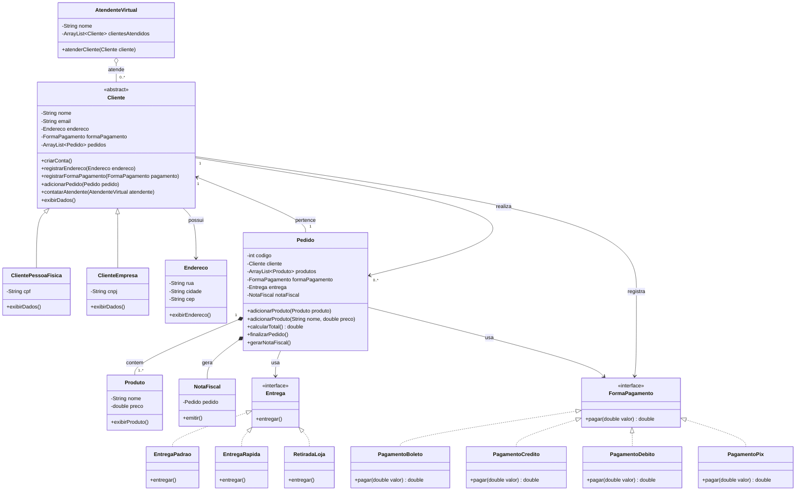

# Planejamento do Projeto - E-commerce em Java com POO

## 1. Contexto do trabalho

Este projeto foi planejado para o Trabalho Final da disciplina de Programacao Orientada a Objetos (POO), do 3o periodo de Sistemas de Informacao. A proposta e desenvolver um e-commerce simples em Java, com foco nos conceitos aprendidos em sala.

O objetivo nao e criar um sistema completo, com telas, banco de dados ou validacoes complexas. O projeto deve executar as funcoes vitais do enunciado, mesmo que os metodos apenas imprimam mensagens no console para mostrar que a relacao entre as classes esta funcionando.

Exemplo de ideia do projeto:

```text
Cliente cria uma conta.
Cliente registra endereco.
Cliente escolhe uma forma de pagamento.
Cliente cria um pedido com produtos.
Pedido calcula o total.
PIX aplica desconto de 15%.
Pedido escolhe uma entrega.
Pedido gera uma nota fiscal.
Cliente pode entrar em contato com um atendente virtual.
```

---

## 2. Objetivo do projeto

Criar um projeto simples de e-commerce em Java que demonstre os conceitos de POO pedidos no trabalho:

- Classes e objetos;
- Instanciacao;
- Encapsulamento;
- Heranca;
- Sobrecarga;
- Sobrescrita;
- Polimorfismo;
- Packages;
- ArrayList;
- Associacao;
- Agregacao;
- Composicao;
- Interfaces / abstracao.

---

## 3. Lista de classes do projeto

A versao proposta usa classes pequenas, mas suficientes para atender os requisitos do trabalho.

```text
1. Main

2. Cliente
3. ClientePessoaFisica
4. ClienteEmpresa

5. Endereco
6. Produto
7. Pedido
8. NotaFiscal
9. AtendenteVirtual

10. FormaPagamento
11. PagamentoBoleto
12. PagamentoCredito
13. PagamentoDebito
14. PagamentoPix

15. Entrega
16. EntregaPadrao
17. EntregaRapida
18. RetiradaLoja
```

---

## 4. Diagrama de classes



---

## 5. Estrutura de arquivos

```text
EcommercePOO/
|
+-- src/
    +-- ecommerce/
        |
        +-- Main.java
        |
        +-- model/
        |   +-- Cliente.java
        |   +-- ClientePessoaFisica.java
        |   +-- ClienteEmpresa.java
        |   +-- Endereco.java
        |   +-- Produto.java
        |   +-- Pedido.java
        |   +-- NotaFiscal.java
        |   +-- AtendenteVirtual.java
        |
        +-- pagamento/
        |   +-- FormaPagamento.java
        |   +-- PagamentoBoleto.java
        |   +-- PagamentoCredito.java
        |   +-- PagamentoDebito.java
        |   +-- PagamentoPix.java
        |
        +-- entrega/
            +-- Entrega.java
            +-- EntregaPadrao.java
            +-- EntregaRapida.java
            +-- RetiradaLoja.java
```

---

## 6. O que sera implementado em cada classe

| Classe | Package | O que sera implementado | Conceito demonstrado |
|---|---|---|---|
| `Main` | `ecommerce` | Classe principal para criar objetos e testar o sistema com `System.out.println()`. | Instanciacao de objetos |
| `Cliente` | `ecommerce.model` | Classe abstrata com nome, email, endereco, forma de pagamento e lista de pedidos. | Encapsulamento, heranca, associacao e ArrayList |
| `ClientePessoaFisica` | `ecommerce.model` | Cliente comum com CPF. | Heranca e sobrescrita |
| `ClienteEmpresa` | `ecommerce.model` | Cliente empresa com CNPJ. | Heranca e sobrescrita |
| `Endereco` | `ecommerce.model` | Guarda rua, cidade e CEP do cliente. | Associacao com Cliente |
| `Produto` | `ecommerce.model` | Produto com nome e preco. | Objeto usado dentro de Pedido |
| `Pedido` | `ecommerce.model` | Guarda cliente, produtos, pagamento, entrega e nota fiscal. | Associacao, composicao, ArrayList e sobrecarga |
| `NotaFiscal` | `ecommerce.model` | Nota fiscal gerada a partir de um pedido. | Composicao |
| `AtendenteVirtual` | `ecommerce.model` | Atendente que pode atender varios clientes. | Agregacao e ArrayList |
| `FormaPagamento` | `ecommerce.pagamento` | Interface com o metodo `pagar(double valor)`. | Interface e abstracao |
| `PagamentoBoleto` | `ecommerce.pagamento` | Implementa pagamento por boleto. | Sobrescrita e polimorfismo |
| `PagamentoCredito` | `ecommerce.pagamento` | Implementa pagamento por credito. | Sobrescrita e polimorfismo |
| `PagamentoDebito` | `ecommerce.pagamento` | Implementa pagamento por debito. | Sobrescrita e polimorfismo |
| `PagamentoPix` | `ecommerce.pagamento` | Implementa PIX com desconto de 15%. | Sobrescrita, polimorfismo e regra de negocio |
| `Entrega` | `ecommerce.entrega` | Interface com o metodo `entregar()`. | Interface e abstracao |
| `EntregaPadrao` | `ecommerce.entrega` | Imprime mensagem de entrega padrao. | Sobrescrita e polimorfismo |
| `EntregaRapida` | `ecommerce.entrega` | Imprime mensagem de entrega rapida. | Sobrescrita e polimorfismo |
| `RetiradaLoja` | `ecommerce.entrega` | Imprime mensagem de retirada na loja. | Sobrescrita e polimorfismo |

---

## 7. Como cada requisito sera atendido

| Requisito | Como sera feito no projeto |
|---|---|
| Cliente criar conta | Metodo `criarConta()` na classe `Cliente`. |
| Cliente registrar endereco | Metodo `registrarEndereco()` usando a classe `Endereco`. |
| Cliente registrar forma de pagamento | Metodo `registrarFormaPagamento()` usando a interface `FormaPagamento`. |
| Cliente adicionar produto ao pedido | Metodo `adicionarProduto()` na classe `Pedido`. |
| Cliente com nome, endereco, email e CPF | Classe `ClientePessoaFisica` herda de `Cliente` e adiciona CPF. |
| Cliente empresa com CNPJ | Classe `ClienteEmpresa` herda de `Cliente` e adiciona CNPJ. |
| Cliente realiza varios pedidos | `ArrayList<Pedido>` dentro da classe `Cliente`. |
| Pedido contem varios produtos | `ArrayList<Produto>` dentro da classe `Pedido`. |
| Produto pertence a um pedido | Produto fica dentro da lista de produtos do pedido. |
| Cliente fala com atendente virtual | Metodo `contatarAtendente()` chama `AtendenteVirtual`. |
| Atendente atende varios clientes | `ArrayList<Cliente>` dentro de `AtendenteVirtual`. |
| Tres formas de entrega | `EntregaPadrao`, `EntregaRapida` e `RetiradaLoja`. |
| Quatro formas de pagamento | Boleto, Credito, Debito e PIX. |
| PIX com 15% de desconto | `PagamentoPix.pagar()` retorna `valor * 0.85`. |
| Pedido gera nota fiscal | Metodo `gerarNotaFiscal()` cria um objeto `NotaFiscal`. |
| Separacao por packages | Packages `model`, `pagamento` e `entrega`. |
| Diagrama de classes | Diagrama apresentado neste documento. |

---

## 8. Onde cada conceito de POO aparece

| Conceito pedido | Onde aparece |
|---|---|
| Objetos | Criados no `Main`, como cliente, produto, pedido, pagamento e entrega. |
| Encapsulamento | Atributos privados com getters e setters. |
| Heranca | `ClientePessoaFisica` e `ClienteEmpresa` herdam de `Cliente`. |
| Sobrecarga | `adicionarProduto(Produto produto)` e `adicionarProduto(String nome, double preco)`. |
| Sobrescrita | `pagar()` em cada pagamento, `entregar()` em cada entrega e `exibirDados()` nos tipos de cliente. |
| Polimorfismo | Variaveis do tipo `FormaPagamento` recebem objetos como `PagamentoPix` ou `PagamentoBoleto`. |
| Packages | Separacao em `model`, `pagamento` e `entrega`. |
| ArrayList | Lista de pedidos no cliente, lista de produtos no pedido e lista de clientes no atendente. |
| Associacao | Cliente possui pedido; pedido possui cliente; pedido usa pagamento e entrega. |
| Agregacao | Atendente virtual atende clientes, mas os clientes existem mesmo sem ele. |
| Composicao | Nota fiscal so existe quando o pedido e gerado. |
| Interface | `FormaPagamento` e `Entrega`. |

---

## 9. Fluxo simples para o Main

```java
public class Main {
    public static void main(String[] args) {
        Cliente cliente = new ClientePessoaFisica(
                "Frederico",
                "fred@email.com",
                "123.456.789-00"
        );

        cliente.criarConta();

        Endereco endereco = new Endereco("Rua A", "Patos de Minas", "38700-000");
        cliente.registrarEndereco(endereco);

        FormaPagamento pagamento = new PagamentoPix();
        cliente.registrarFormaPagamento(pagamento);

        Entrega entrega = new EntregaRapida();

        Pedido pedido = new Pedido(1, cliente, pagamento, entrega);

        pedido.adicionarProduto(new Produto("Mouse", 80.00));
        pedido.adicionarProduto("Teclado", 120.00);

        cliente.adicionarPedido(pedido);

        pedido.finalizarPedido();

        AtendenteVirtual atendente = new AtendenteVirtual("Atendente Bot");
        cliente.contatarAtendente(atendente);
    }
}
```

Possivel saida no console:

```text
Conta criada para Frederico.
Endereco registrado para Frederico.
Forma de pagamento registrada.
Produto Mouse adicionado ao pedido.
Produto Teclado adicionado ao pedido.
Total do pedido: R$ 200.0
Pagamento via PIX realizado com 15% de desconto.
Valor final: R$ 170.0
Entrega rapida selecionada.
Nota fiscal emitida para o pedido 1.
Cliente Frederico esta sendo atendido pelo Atendente Bot.
```

---

## 10. Conclusao

A proposta fica simples e adequada para um projeto de 3o periodo. O sistema nao tenta ser um e-commerce completo; ele apenas demonstra, por meio de classes pequenas e metodos simples, os principais conceitos de POO pedidos no trabalho.

O ponto principal do projeto e conseguir explicar na apresentacao onde cada conceito aparece no codigo. Por isso, a estrutura foi dividida em packages, com heranca em clientes, interfaces em pagamento e entrega, composicao em pedido e nota fiscal, e ArrayLists para representar as relacoes de um para muitos.
